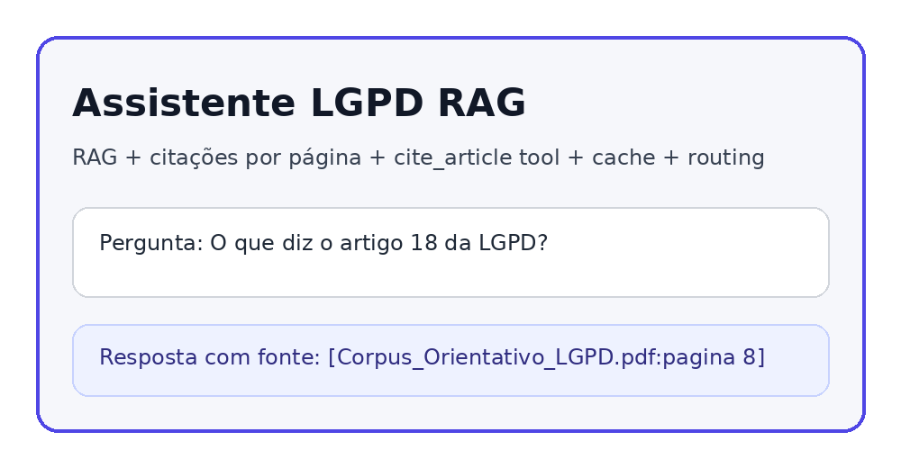
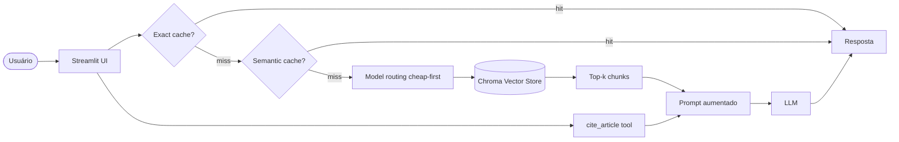

# Assistente LGPD RAG

> Assistente com IA generativa para responder perguntas sobre LGPD usando RAG, citações por página, tool-use para artigos legais, cache e roteamento de modelo.

**Live demo:** https://assistente-lgpd-rag.streamlit.app/ 

**Repositório:** https://github.com/carolanely/assistente-lgpd-rag  

**Vídeo demo:** 



## Problem statement

Pequenas equipes de produto, desenvolvimento e atendimento precisam consultar rapidamente conceitos da LGPD, mas a informação costuma ficar dispersa em leis, guias e políticas internas. Uma busca simples por palavra-chave não entende perguntas em linguagem natural nem combina conceitos como base legal, retenção, incidente e direitos do titular.

Este projeto resolve isso com um assistente RAG que busca trechos relevantes no corpus, gera resposta com citação de página e usa uma tool específica (`cite_article`) para reduzir alucinações quando a pergunta envolve artigos da LGPD.

> Observação: o projeto é educativo e não substitui parecer jurídico, DPO ou consulta ao texto oficial atualizado.

## Escopo individual

A consigna original sugere entrega em dupla, mas este repositório foi organizado para entrega individual. Assim, todas as frentes foram consolidadas em uma única implementação: pipeline RAG, tool-use, cache, routing, UI, README e deploy.

## Corpus escolhido

- `data/corpus/Corpus_Orientativo_LGPD.pdf`
- 17 páginas textuais.
- Tema: LGPD aplicada a decisões comuns de produto e desenvolvimento.
- Conteúdo: conceitos, princípios, bases legais, consentimento, dados sensíveis, crianças e adolescentes, direitos do titular, retenção, segurança, incidentes, registros e checklist operacional.

Perguntas que se beneficiam de RAG:

1. Quais princípios devo observar ao criar um formulário de cadastro?
2. Posso armazenar CPF para emitir nota fiscal? Qual base legal pode justificar isso?
3. O que devo fazer se houver vazamento de e-mails e telefones de clientes?
4. Quando o consentimento é necessário e como devo registrá-lo?
5. Quais direitos o titular pode exercer sobre seus dados?

## Arquitetura



Fluxo principal:

1. O usuário pergunta em linguagem natural.
2. O app verifica cache exato por hash SHA256.
3. Se não houver hit, verifica cache semântico por similaridade de embeddings.
4. O roteador classifica a pergunta como simples ou complexa.
5. O RAG recupera os trechos mais relevantes no Chroma.
6. Se a pergunta mencionar artigo, a tool `cite_article` retorna uma referência controlada.
7. O LLM gera resposta com base no contexto recuperado e cita fonte no formato `[arquivo:pagina]`.

## Setup local

```bash
# 1. Clone o repositório
 git clone <seu-repo>
 cd assistente-lgpd-portfolio

# 2. Crie o ambiente
 python -m venv .venv
 source .venv/bin/activate  # Windows: .venv\Scripts\activate

# 3. Instale dependências
 pip install -r requirements.txt

# 4. Configure a API key
 cp .env.example .env
 # edite .env e preencha GEMINI_API_KEY ou OPENAI_API_KEY

# 5. Rode a aplicação
 streamlit run src/ui/streamlit_app.py
```

## Deploy no Streamlit Cloud

1. Suba este projeto para um repositório público no GitHub.
2. Acesse Streamlit Community Cloud e crie um novo app.
3. Selecione o repositório e use como entrypoint:
   ```bash
   src/ui/streamlit_app.py
   ```
4. Em **Settings > Secrets**, adicione:
   ```toml
   GEMINI_API_KEY="sua-chave"
   LLM_MODEL="gemini-2.5-flash-lite"
   EMBED_MODEL="gemini-embedding-001"
   CHEAP_MODEL="gemini-2.5-flash-lite"
   PREMIUM_MODEL="gemini-2.5-pro"
   ```
5. Abra a URL pública em aba anônima antes de enviar.

## Tool-use customizado

A tool específica do domínio está em `src/pipeline/tools.py`.

```python
def cite_article(article_number: int) -> str:
    """Retorna explicação controlada de um artigo da LGPD."""
```

Ela é útil porque LLMs podem inventar números de artigos ou misturar conceitos legais. A tool mapeia artigos frequentes da LGPD, como 6, 7, 10, 11, 14, 18, 37, 38, 41, 46, 48 e 52. Quando a pergunta menciona `artigo 18`, por exemplo, o pipeline adiciona a saída da tool ao contexto e também disponibiliza a função via function-calling.

## Custo e latência

Medição estimada para 50 perguntas de teste, considerando repetição de dúvidas comuns em uma turma/equipe. Os valores devem ser substituídos pelos números reais após rodar a demo com logs.

| Estratégia | Chamadas LLM esperadas | Redução estimada | P95 latency esperado |
|---|---:|---:|---:|
| Baseline: LLM em toda pergunta | 50 | — | 6-10 s |
| + Exact cache | 38 | 24% | 2-6 s |
| + Semantic cache | 28 | 44% | 2-6 s |
| + Routing cheap-first | 28, com maioria no modelo barato | 50%+ em custo relativo | 2-8 s |

Como medir no vídeo/demo:

- Faça a mesma pergunta duas vezes para mostrar `Exact cache hit`.
- Faça uma paráfrase da pergunta para mostrar potencial de `Semantic cache`.
- Mostre no sidebar a quantidade de chunks indexados e caches.
- Mostre a mensagem `Routing: simple` ou `Routing: complex`.

## Design decisions

- **Modalidade escolhida:** Template + corpus próprio, porque é o caminho mais seguro para cumprir a rubrica no tempo da disciplina.
- **Domínio escolhido:** LGPD, pois é um corpus textual denso, realista e com aplicação prática para desenvolvimento de software.
- **Chunking:** `chunk_size=800` e `chunk_overlap=100`, equilibrando contexto suficiente por trecho e boa granularidade de recuperação.
- **Vector store:** Chroma local, simples de versionar como dependência e adequado para corpus pequeno/médio.
- **Tool específica:** `cite_article`, porque perguntas jurídicas frequentemente dependem de número de artigo e isso reduz alucinação.
- **Cache:** combinação de exact cache e semantic cache para reduzir chamadas repetidas ao LLM.
- **Routing:** heurística cheap-first, usando modelo barato para perguntas simples e modelo premium para perguntas de análise/risco.

## Limitations

- O corpus é fixo e educativo; não substitui consulta ao texto legal oficial atualizado.
- O app não faz upload dinâmico de novos PDFs pelo usuário final.
- O semantic cache depende de API de embeddings; se a chave falhar ou houver rate limit, o app continua funcionando sem cache semântico.
- A avaliação RAGAS não foi automatizada neste pacote, mas a arquitetura permite adicionar um conjunto de perguntas e respostas esperadas.
- A tool cobre artigos frequentes, não todos os artigos da LGPD.

## Tech stack

- **LLM:** Gemini 2.5 Flash-Lite por padrão; compatível com OpenAI.
- **Embeddings:** `gemini-embedding-001` por padrão; fallback configurável para OpenAI.
- **Vector store:** Chroma local.
- **PDF parsing:** pypdf.
- **Chunking:** LangChain Text Splitters.
- **UI:** Streamlit.
- **Observability:** logs estruturados com `trace_id`.
- **Deploy:** Streamlit Community Cloud.

## Estrutura

```text
assistente-lgpd-portfolio/
├── data/
│   └── corpus/
│       └── Corpus_Orientativo_LGPD.pdf
├── src/
│   ├── ui/streamlit_app.py
│   ├── pipeline/
│   │   ├── rag.py
│   │   ├── tools.py
│   │   ├── cache.py
│   │   └── routing.py
│   └── observability/trace.py
├── tests/test_smoke.py
├── requirements.txt
├── pyproject.toml
├── .env.example
└── README.md
```

## Checklist de entrega

- [ ] Repositório público no GitHub.
- [ ] URL pública do Streamlit funcionando sem login.
- [ ] README preenchido com links reais.
- [ ] Vídeo demo de até 3 minutos.
- [ ] Pergunta com RAG respondendo e citando fonte.
- [ ] Tool `cite_article` demonstrada.
- [ ] Cache hit demonstrado.
- [ ] Routing demonstrado.

## Roteiro sugerido para vídeo de até 3 minutos

**0:00-0:30 - Problema e corpus**  
"Este projeto é um Assistente LGPD RAG para apoiar equipes de produto e desenvolvimento. Ele usa um corpus de 17 páginas com conceitos da LGPD, segurança, direitos do titular e incidentes. A ideia é responder perguntas com fonte, sem depender apenas da memória do modelo."

**0:30-1:30 - Fluxo RAG + tool-use**  
Faça a pergunta: "O que diz o artigo 18 da LGPD?". Mostre que a resposta cita fonte e que a sidebar tem a tool para consultar artigo. Explique que a tool reduz alucinação sobre números legais.

**1:30-2:15 - Cache e routing**  
Repita a mesma pergunta para mostrar cache exato. Depois faça uma pergunta simples e uma complexa para mostrar a decisão do routing.

**2:15-3:00 - Decisão de design e limites**  
"Escolhi LGPD por ser um domínio textual denso e útil. Usei Chroma, chunking 800/100, cache e roteamento cheap-first. A limitação principal é que o corpus é fixo e educativo; para uso real, deve ser validado com jurídico ou DPO."
